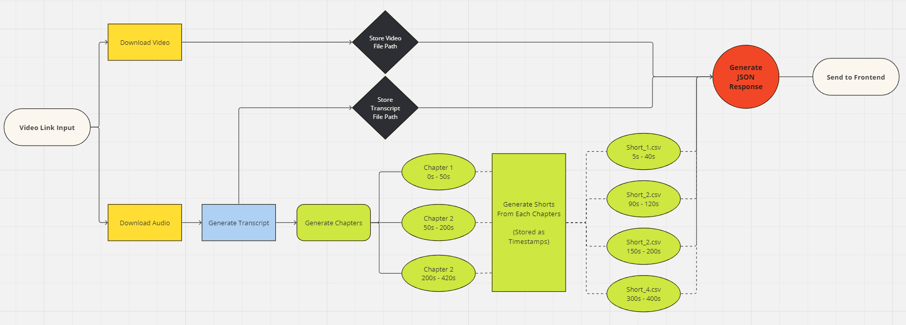

# YT Creator

YT Creator is a generative AI tool designed to transform long-form content, such as talking head videos and podcasts, into short clips with just a single click.

## How it works

### Backend

1. Receives Video Link from Frontend - [views.py](ytcreator\views.py)

2. Video and Audio is downloaded and paths are saved - [videodownloader.py](src/youtube/videodownloader.py)

3. Audio is transcribed with word level timestamps - [maintranscribe.py](src\transcribe\maintranscribe.py)

4. Chapters are generated using OpenAI's GPT-3.5 LLM - [gpt.py](src\shortgen\gpt.py)

5. Each Chapter is fed to GPT-4 to create shorts - [gpt.py](src\shortgen\gpt.py)

6. All shorts are saved in the JSON response - [responsegenerator.py](src\responsegenerator.py)

7. JSON response is sent back to Frontend - [views.py](ytcreator\views.py)